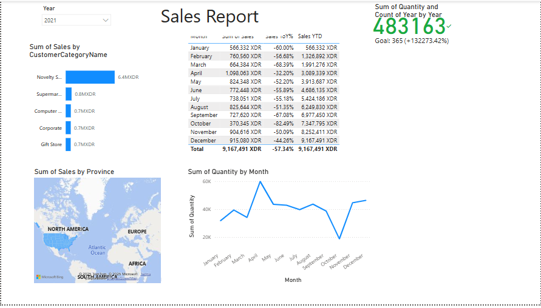

# 📊 Power BI Sales Dashboard (2018–2021)

This project presents an interactive Power BI dashboard analyzing retail sales data from 2018 to 2021. It showcases insights using KPIs, charts, and map visuals.

---

## 🎯 Objectives

- Monitor sales and quantity over time
- Segment customers by category
- Identify sales trends and monthly growth/decline
- Compare real performance with predefined goals
- Visualize sales geographically

---

## 📌 Dashboard Features

- 📅 **Monthly Sales Table**: Sales per month with % change and YTD totals
- 📈 **Line Chart**: Quantity sold by month
- 📦 **Bar Chart**: Sales by customer category (e.g., Supermarket, Gift Store)
- 🌍 **Map Visual**: Total sales by province (geo-analysis)
- ✅ **KPI Card**: Quantity vs. Goal (e.g., `483,163` vs. target `365`)

---

## 🛠 Tools Used

- Power BI Desktop
- Power Query (Data Transformation)
- DAX formulas (e.g., % variation, cumulative totals)

---

## 📁 Files

- `Report.pbix` : Power BI report file
- `dashboard.png` : Report screenshot

---

## 📸 Screenshot

---

